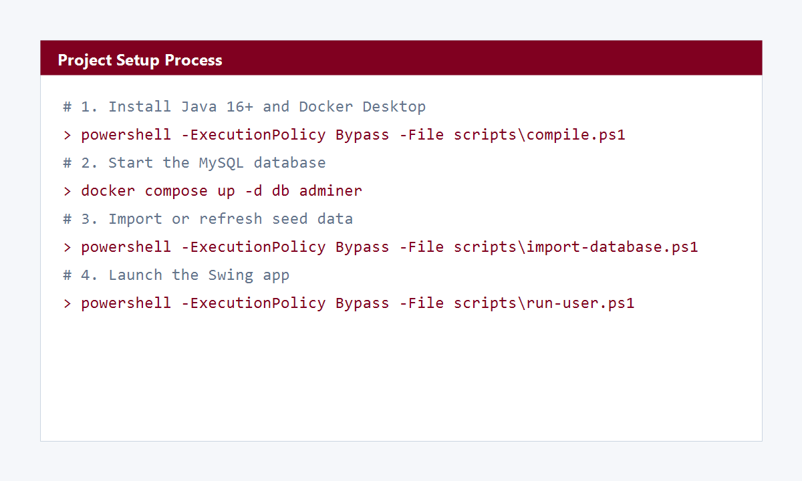
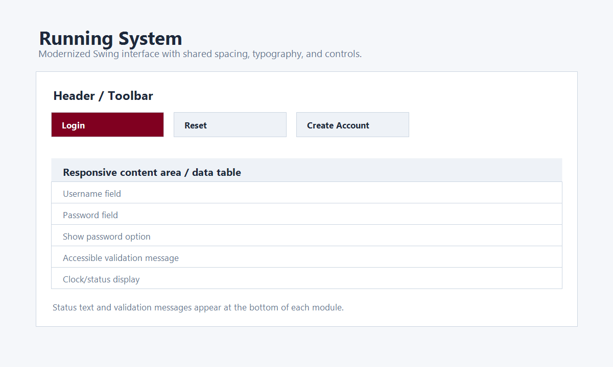
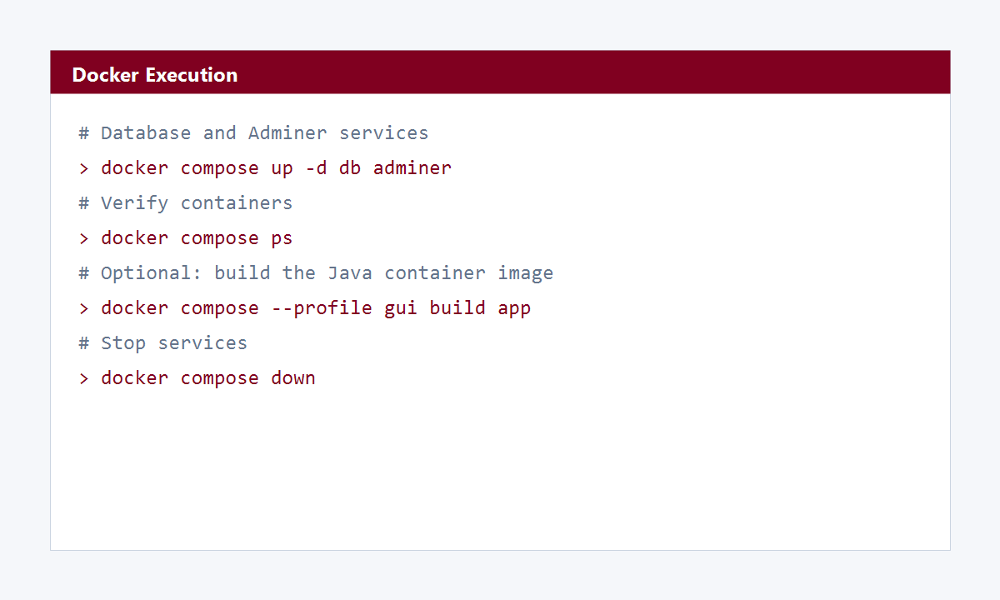
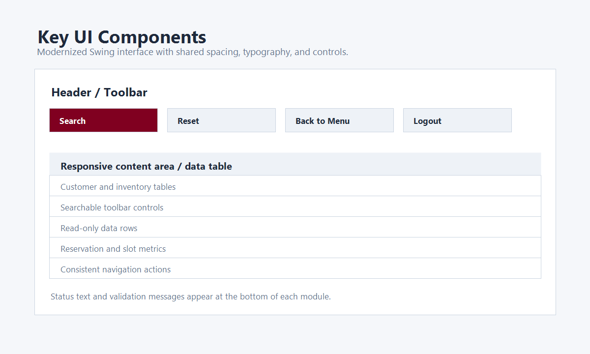

# Online Parking Reservation

Java Swing desktop application for customer parking profiles, administrator inventory, slot tracking, reservations, and billing.

The active application code is in `src/`. The old applet project remains in `legacy/PUP_Information-Form-JApplet` for reference only.

## Project Setup

### Requirements

- Java JDK 16 or newer
- Docker Desktop, for the recommended MySQL database
- PowerShell 5+ on Windows
- Internet access for the first compile, because the helper script downloads:
  - `mysql-connector-java-8.0.19.jar`
  - `jcalendar-1.4.jar`

### Environment Variables

The database connection is controlled by environment variables. If none are set, the app uses the Docker-friendly defaults below.

| Variable | Default | Purpose |
| --- | --- | --- |
| `OPR_DB_HOST` | `localhost` | MySQL host |
| `OPR_DB_PORT` | `3306` | MySQL port |
| `OPR_DB_NAME` | `onlineparkingreservation` | Database name |
| `OPR_DB_USER` | `root` | Database user |
| `OPR_DB_PASSWORD` | `Qwerty123@` | Database password |

Copy `.env.example` to `.env` when you want Docker Compose to use custom values.

### Local Run Steps

1. Start Docker Desktop.
2. Start MySQL and Adminer:

```powershell
docker compose up -d db adminer
```

3. Import or refresh the seed database:

```powershell
powershell -ExecutionPolicy Bypass -File scripts\import-database.ps1
```

4. Compile the Java source:

```powershell
powershell -ExecutionPolicy Bypass -File scripts\compile.ps1
```

5. Run the customer app:

```powershell
powershell -ExecutionPolicy Bypass -File scripts\run-user.ps1
```

6. Run the admin app:

```powershell
powershell -ExecutionPolicy Bypass -File scripts\run-admin.ps1
```

Demo customer login:

- Username: `Harayuri`
- Password: `qwerty`

Demo admin login:

- Username: `SecretlySpy`
- Password: `qwerty`

## Feature Overview

### Customer Features

- Role-based customer login and registration.
- Real-time slot availability refreshed every 5 seconds.
- Slot search by floor, vehicle/slot type, availability, date, and time range.
- Scheduled reservation booking with start and end times.
- Reservation history with unique reservation codes and verification payloads.
- Profile and vehicle profile screens linked to the signed-in customer.

### Admin Features

- Separate role-based admin login and registration.
- Admin dashboard for customer profiles, parking inventory, slots, reservations, billing, and reports.
- Live slot monitor with floor/type/availability filters.
- Slot status management for marking spaces `available` or `maintenance`.
- Reservation manager for filtering by status/floor and updating reservations to `reserved`, `occupied`, `completed`, or `cancelled`.
- Reports screen with slot counts, availability, reservation status totals, and recent system activity.

### Quality-of-Life Features

- Booking confirmations are logged to `notification_log` as queued email-style notifications.
- Each reservation receives a unique code such as `RSV-20260523145500-S4`.
- Each reservation stores a verification payload that can be used later for QR-code generation.
- Form validation and database error handling are centralized through reusable helpers.

## Docker Instructions

`docker-compose.yml` provides the database services used by the desktop app.

- `db`: MySQL 8.0, seeded from `Online Parking Reservation Database/`
- `adminer`: browser database viewer at `http://localhost:8080`
- `app`: optional Java image under the `gui` profile

Build and run database services:

```powershell
docker compose up -d db adminer
```

Build the Java Docker image:

```powershell
docker compose --profile gui build app
```

Stop containers:

```powershell
docker compose down
```

Reset database volume and re-run seed scripts:

```powershell
docker compose down -v
docker compose up -d db adminer
```

The Swing GUI is intended to run on the host desktop through `scripts\run-user.ps1` or `scripts\run-admin.ps1`. The Docker `app` service is provided mainly as a reproducible build/runtime image; running Swing windows inside Docker requires a host display server.

## System Configuration

### Important Files

| Path | Purpose |
| --- | --- |
| `src/app/AppConfig.java` | Reads database settings from system properties or environment variables |
| `src/app/DatabaseInitializer.java` | Creates enhanced reservation tables at runtime when missing |
| `src/app/AppTheme.java` | Shared Swing theme, colors, spacing, table styling, and frame helpers |
| `src/app/ReservationRepository.java` | Slot availability, booking, reservation history, reports, and activity logging |
| `src/DatabaseConnection/ConnectionDB.java` | Creates MySQL connections using `AppConfig` |
| `scripts/compile.ps1` | Downloads jars into `build/lib` and compiles classes into `build/classes` |
| `scripts/import-database.ps1` | Starts the Docker database and imports SQL seed files |
| `Dockerfile` | Builds the Java application image with required jars |
| `docker-compose.yml` | Defines MySQL, Adminer, and optional GUI app services |

### Folder Structure

```text
.
├── Online Parking Reservation Database/   SQL schema and seed data
├── docker/mysql/                          Docker database initialization
├── docs/screenshots/                      Setup, Docker, and UI visual aids
├── scripts/                               Compile, run, and database helper scripts
├── src/
│   ├── DatabaseConnection/                JDBC connection wrapper
│   ├── adminmanagement/                   Admin screens and workflows
│   ├── app/                               Shared config and UI theme helpers
│   └── usermanagement/                    Customer screens and workflows
└── legacy/                                Archived applet project
```

## Visual Aids

### Setup Process



### Running the System



### Docker Execution



### Key UI Components



## Modernization Notes

- Replaced duplicated login/menu styling with shared `AppTheme` helpers.
- Added environment-driven database settings through `AppConfig`.
- Added enhanced reservation tables for live slot availability, scheduling, notification logs, and activity monitoring.
- Updated main customer and admin screens to use layout managers instead of fixed absolute positioning. The desktop UI resizes smoothly across common desktop and tablet-sized windows; native mobile deployment would require a separate mobile frontend.
- Improved search, reset, status, and navigation behavior across customer, inventory, reservation, slot, history, report, and billing screens.
- Fixed admin login and reservation insert workflows so successful actions happen immediately and save the intended field values.
- Added comments to new and refactored code where they explain purpose, dependencies, and non-obvious logic.
