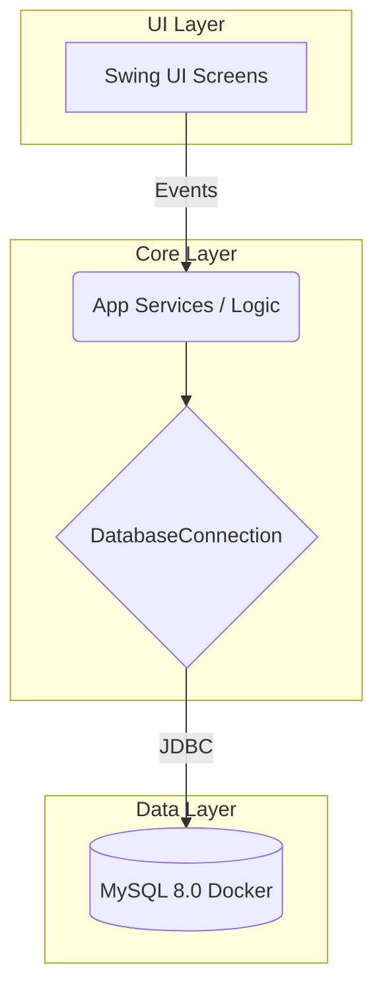
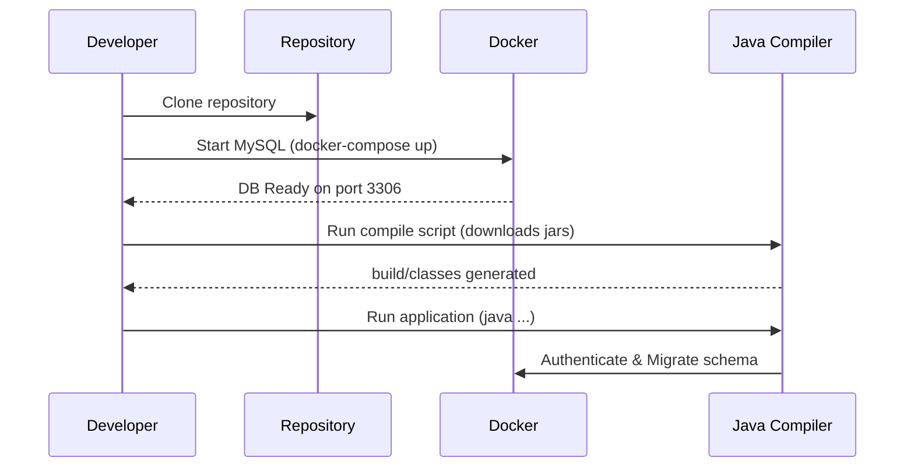

# Tech Stack Setup Guide

## 1. Tech Stack Overview

| Component | Technology | Version | Notes |
| :--- | :--- | :--- | :--- |
| **Language** | Java SE | 16+ (Verified JDK 25) | Core logic and syntax |
| **GUI Framework** | Java Swing | N/A (Standard library) | Desktop UI components |
| **Database** | MySQL | 8.0 | Relational data store |
| **JDBC Driver** | MySQL Connector/J | 8.0.19 | Database connectivity |
| **UI Library** | JCalendar | 1.4 | Date picker components |
| **Build System** | PowerShell / Bash | N/A | Custom scripts (`scripts/`) |
| **Containerization** | Docker | Latest | Local DB provisioning |

## 2. Architecture & Data Flow



## 3. Setup Instructions

### Pre-requisites (All Platforms)
1. Install **Java Development Kit (JDK) 16** or higher.
2. Install **Docker Desktop** (or Docker Engine + Docker Compose).

### Windows Setup

1. **Start the Database**
   Open PowerShell in the project root and run:
   ```powershell
   .\scripts\import-database.ps1
   ```
   *(This starts the MySQL container and runs the initial seed scripts).*
2. **Compile the App**
   ```powershell
   .\scripts\compile.ps1
   ```
3. **Run the App**
   - For Customer Login: `.\scripts\run-user.ps1`
   - For Admin Login: `.\scripts\run-admin.ps1`

### macOS / Linux Setup

*(Note: The project uses PowerShell scripts by default, but you can run the equivalent commands in bash/zsh)*

1. **Start the Database**
   Open your terminal and run Docker Compose:
   ```bash
   docker-compose up -d db
   ```
   *(Ensure you run the import scripts inside the `docker/mysql` or `Online Parking Reservation Database` folder if they are not auto-imported).*
2. **Compile the App**
   Create the build directories and compile:
   ```bash
   mkdir -p build/lib build/classes
   # Download dependencies (curl/wget) into build/lib
   curl -o build/lib/mysql-connector-java-8.0.19.jar https://repo.maven.apache.org/maven2/mysql/mysql-connector-java/8.0.19/mysql-connector-java-8.0.19.jar
   curl -o build/lib/jcalendar-1.4.jar https://repo.maven.apache.org/maven2/com/toedter/jcalendar/1.4/jcalendar-1.4.jar
   # Compile
   javac -cp "build/lib/*:src" -d build/classes $(find src -name "*.java")
   ```
3. **Run the App**
   ```bash
   # Customer
   java -cp "build/lib/*:build/classes" usermanagement.login
   # Admin
   java -cp "build/lib/*:build/classes" adminmanagement.login
   ```

## 4. Setup Workflow Visualization



## 5. Troubleshooting

- **Error: "Database connection failed"**
  - **Cause:** Docker is not running or the MySQL container failed to start.
  - **Fix:** Ensure Docker Desktop is running. Check container logs with `docker logs <container_name>`. Verify port `3306` is not occupied by a local MySQL installation.
- **Error: "class not found" or compilation errors**
  - **Cause:** Missing JAR files in `build/lib` or incorrect Java version.
  - **Fix:** Ensure you are using JDK 16+. Re-run the compile script to ensure it successfully downloads `mysql-connector-java` and `jcalendar`.
- **UI Scaling Issues (4K Monitors)**
  - **Cause:** Swing DPI scaling.
  - **Fix:** Pass `-Dsun.java2d.uiScale=1.0` or higher when running the application.
